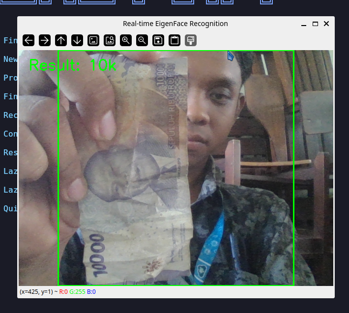

# Pengenalan Wajah dengan Metode Eigenface

Eigenface adalah salah satu metode pengenalan wajah yang memanfaatkan teknik **Principal Component Analysis (PCA)** untuk mengurangi dimensi data citra wajah. Dalam proyek ini, PCA diimplementasikan menggunakan **Singular Value Decomposition (SVD)** yang dihitung secara manual tanpa fungsi bawaan.

## Apa itu Dekomposisi Matriks?
Dekomposisi matriks adalah proses memecah satu matriks menjadi beberapa matriks penyusun yang lebih sederhana. Bayangkan seperti angka $12$ yang bisa didekomposisi (difaktorkan) menjadi $3 \times 4$ untuk melihat struktur penyusun angka tersebut.

Dalam proyek ini, kita memecah matriks data wajah ($A$) menjadi:
$$A = U \Sigma V^T$$
- **$U$**: Hubungan antar gambar (siapa mirip siapa).
- **$\Sigma$**: Tingkat kepentingan fitur (seberapa menonjol fitur tersebut).
- **$V^T$**: Pola fitur itu sendiri (disebut **Eigenfaces**).

## Langkah-langkah Perhitungan Manual

### 1. Representasi Citra sebagai Vektor
Setiap citra wajah diubah menjadi vektor baris tunggal. Jika kita memiliki $M$ citra latih, maka kita memiliki matriks data berukuran $M \times N$.

### 2. Menghitung Rata-rata Wajah (Mean Face)
Menghitung wajah "tengah" dari semua data.
Dalam kode (`eigenface.cpp`):
```cpp
reduce(data, rata_rata, 0, REDUCE_AVG);
```

### 3. Normalisasi Data (Mean Centering)
Setiap gambar dikurangi `rata_rata` agar data terpusat. Hasilnya adalah matriks **$A$**.
```cpp
A.push_back(data.row(i) - rata_rata);
```

### 4. Menghitung Komponen Utama (Dekomposisi SVD)
Proses dekomposisi terjadi di fungsi `train()`:

1.  **Mencari $U$ dan $\Sigma$**:
    Kita menghitung matriks kovarians $C = A A^T$, lalu memanggil:
    ```cpp
    hitung_eigen_manual(C, nilai_eigen, U);
    ```
    Di sini $C$ dipecah menjadi vektor eigen ($U$) dan nilai eigen ($\lambda$).

2.  **Mencari $V^T$ (Eigenfaces / `wajah_eigen`)**:
    Dihitung secara manual dengan rumus $V = A^T U \Sigma^{-1}$:
    ```cpp
    Mat v_i = (A.t() * U.col(i)) / S; // S adalah akar nilai_eigen
    ```

### 5. Proyeksi ke Ruang Wajah
Mengubah gambar baru menjadi koordinat di ruang wajah eigen.
```cpp
Mat selisih = sampel - rata_rata;
return selisih * wajah_eigen.t();
```

### 6. Proses Pengenalan (Recognition)
1. Gambar baru diproyeksikan menggunakan `proyeksikan()`.
2. Jarak Euclidean dihitung terhadap data latihan yang sudah tersimpan di `hasil_proyeksi`.
3. Jarak terkecil menentukan hasil prediksi.

```cpp
double jarak = norm(query, hasil_proyeksi[i], NORM_L2);
```

## Implementasi Real-time
Proyek ini berjalan secara real-time menangkap wajah dari kamera, melakukan praproses (grayscale, resize 64x64), dan memprediksi identitas menggunakan logika di atas.

# Instalasi 

### Debian/Ubuntu
```bash
sudo apt install libopencv-dev
```

# Repository
[https://github.com/yohanesokta/eigenface-kal](https://github.com/yohanesokta/eigenface-kal)

# Dokumentasi Visual

